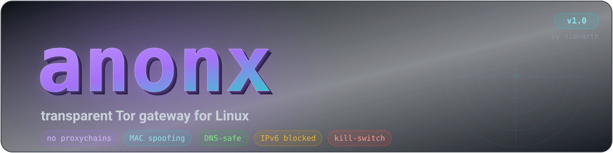
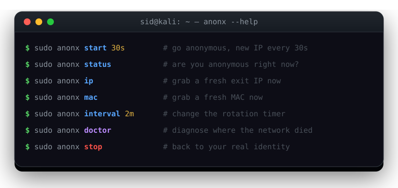

<!-- ───────────────────────────  anonx  ─────────────────────────── -->

<div align="center">



<br>

<a href="#-install"></a>


<br><br>

<b>One command puts your whole machine behind Tor.</b><br>
<sub>Every TCP connection · every DNS query · a spoofed MAC · IPv6 killed · exit IP on a timer — no <code>proxychains</code>, no per-app config.</sub>

<br><br>



</div>

<br>

## ✨ Why anonx

Most people chain `proxychains` in front of one app and hope. anonx works one
layer lower — in the **kernel firewall** — so *everything* leaves through Tor
whether it knows about Tor or not: your browser, `apt`, `curl`, a Python script,
a stray telemetry ping. If Tor ever drops, a kill-switch rule stops traffic
instead of leaking it.

<table>
<tr>
<td width="50%" valign="top">

**🧅 Full-system, not per-app**
Kernel `nat` redirects every SYN into Tor's `TransPort`. Nothing has to opt in.

**🛡️ Hard kill-switch**
The last firewall rule is `REJECT`. No Tor → no traffic. Leaks are impossible, not just unlikely.

**🔀 Rotating identity**
Fresh exit IP every `30s`, `2m`, `1h` — you choose. New MAC on demand too.

</td>
<td width="50%" valign="top">

**🚫 DNS & IPv6 sealed**
DNS is forced through Tor and `resolv.conf` is frozen; IPv6 is dropped whole (Tor is IPv4-only).

**🩺 Self-healing**
`doctor` names the exact layer that broke; `repair` force-restores a half-broken network.

**💬 Speaks human**
Status says **ANONYMOUS** / **OFF** in one word, then explains every line — no jargon wall.

</td>
</tr>
</table>

<br>

## 🚀 Install

```bash
git clone https://github.com/sid0x1/anonx.git
cd anonx
sudo ./install.sh
```

The installer is careful: it first checks the machine can actually run anonx
(Debian/Kali/Ubuntu + systemd + a working nat table) and **refuses to install
where it wouldn't work**, then verifies and installs every dependency (`tor`,
`macchanger`, `ethtool`, `iptables`, `curl`, `xxd`, `iproute2`), wires the
transparent-proxy block into `/etc/tor/torrc`, and finishes with a **live smoke
test** — it starts Tor, confirms the ports bind and the circuit builds, then
stops it. If Tor can't come up on your box, the install aborts cleanly instead of
leaving something broken.

Remove it any time with `sudo ./uninstall.sh --purge` — it restores your network
first, so you can never uninstall yourself into a locked firewall.

<br>

## ⚡ Commands

<div align="center">

</div>

<br>

| Command | What it does |
|---|---|
| `sudo anonx start` `[time]` | Go anonymous. Optional rotation interval, e.g. `start 30s` |
| `sudo anonx stop` | Back to your real identity, Tor shut down |
| `sudo anonx status` | Are you anonymous right now? — in plain words |
| `sudo anonx ip` | New exit IP immediately |
| `sudo anonx mac` | New MAC immediately (rebuilds Tor circuits after) |
| `sudo anonx interval` `<time>` | Set how often the IP changes (`10s` … `1h`) |
| `sudo anonx doctor` | Layer-by-layer diagnosis of what broke |
| `sudo anonx repair` | Force everything back to a working network |
| `sudo anonx update` | Fetch the latest version |
| `sudo anonx enable` / `disable` | Autostart on boot, or turn that off |
| `anonx --help` | Full help &nbsp;·&nbsp; `anonx version` shows the banner |

Time format: `30s` seconds · `5m` minutes · `1h` hours (minimum `10s`, because
Tor rate-limits new circuits below that).

<br>

## 📸 Screenshots

<div align="center">



<sub>One glance tells you everything — the verdict up top, every layer explained below.</sub>

</div>

<br>

## 🔍 Verify it works

```bash
curl https://check.torproject.org/api/ip     # → {"IsTor":true,"IP":"..."}
curl -6 https://ipv6.google.com              # → must FAIL (v6 is blocked)
```

<br>

## 🧠 How it works

| Layer | What anonx does |
|---|---|
| **TCP** | `nat OUTPUT` redirects every SYN to Tor's `TransPort` (9040) |
| **DNS** | port 53 → Tor's `DNSPort` (5353); `resolv.conf` pinned to `127.0.0.1` and made immutable |
| **Kill switch** | last `filter OUTPUT` rule is `REJECT` — Tor dies, traffic stops |
| **IPv6** | dropped entirely (Tor's transparent proxy is IPv4-only) |
| **MAC** | randomized via NetworkManager's `cloned-mac-address`, so it survives reconnects |
| **Exit IP** | `SIGNAL NEWNYM` on the control port every *N* seconds |
| **LAN** | DHCP, gateway and RFC1918 stay reachable, so the link keeps its lease |

<details>
<summary><b>Design notes — two bugs that shaped the whole tool</b></summary>

<br>

**Changing the MAC tears down Tor.** A MAC change bounces the link, every TCP
connection Tor holds dies with it, and Tor doesn't always rebuild its guards on
its own. If the firewall is already forcing traffic into Tor at that moment, the
machine goes dark. So `start` randomizes the MAC **first**, waits for the gateway
to answer, and only then starts Tor.

**`Bootstrapped 100%` ≠ "ready".** Tor's `TransPort` accepts connections the
instant the daemon starts, long before it has a circuit. Locking the firewall
there is a perfect blackout. anonx polls the control port, fetches a real URL
through SOCKS, and only locks after **both** succeed — then verifies the locked
path and **rolls back automatically** if it fails. A failed `start` always leaves
you with a working network.

</details>

<br>

## 🛣️ Roadmap — coming in `v1.2`

<sub>anonx today is a solid transparent-Tor gateway. Next it grows into a full anonymity cockpit.</sub>

**🥇 Tier 1 — bigger shields**
- `anonx leaktest` — one command that hammers DNS / IPv6 / WebRTC / transparent-proxy leaks and scores you
- **Bridges & pluggable transports** (`obfs4`, `snowflake`) — reach Tor even where it's censored, with auto-fallback
- **Choose your exit country** — `anonx exit de`, `anonx exit us` (`ExitNodes` + `StrictNodes`)
- **Fail-closed at boot** — lock the firewall *before* the network is up, so even the startup window can't leak
- `anonx panic` — instantly drop connections, restore identity and flush caches

**🥈 Tier 2 — smaller fingerprint**
- Randomized hostname + forced UTC timezone (two of the biggest fingerprint vectors)
- **Stream isolation** — a separate Tor circuit per destination, so sites can't be correlated
- Log & trace scrubbing — volatile journald, shell history off, swap off/encrypted
- Vendor-preserving MAC option (some routers block unknown OUIs)

**🥉 Tier 3 — polish & power**
- `anonx watch` — a live TUI dashboard (IP · circuit · bandwidth · countdown)
- **Whitelist mode** — keep the LAN printer / SSH reachable while everything else rides Tor
- Desktop notification on every exit-IP change
- Shell completion, a man page, and one-command `.onion` hosting

<sub>Ideas or requests? Open an issue — the list is driven by what people actually need.</sub>

<br>

## ⚠️ Limitations

- `ping 8.8.8.8` fails while locked — ICMP can't ride Tor. That's the design; websites still work.
- UDP (except DNS) is dropped: video calls, WireGuard and most games won't work while locked.
- Tor hides your **IP, not your habits** — logging into your own accounts still identifies you. For browsing, use the Tor Browser.
- MAC randomization only hides you from the local network segment.
- Tested on Kali (NetworkManager + `tor@default`); other Debian derivatives should work.

<br>

## 📜 Legal

For your own machines, lab networks and authorized testing only. Circumventing
network controls you don't own is illegal in most places, and Tor is not a
licence to do it — you are responsible for what you send through it.

<br>

<div align="center">

**MIT** licensed — see [LICENSE](LICENSE)

<sub>built with 🧅 by <a href="https://github.com/sid0x1">sidh4ck3r</a> · stay safe out there</sub>

</div>
